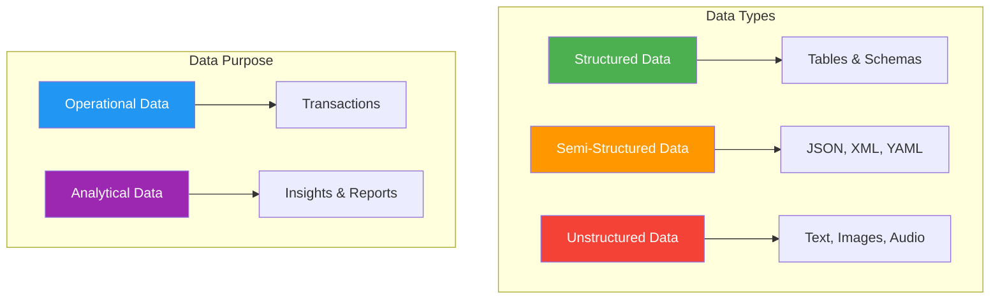
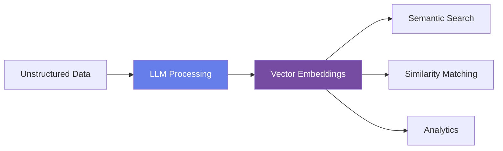
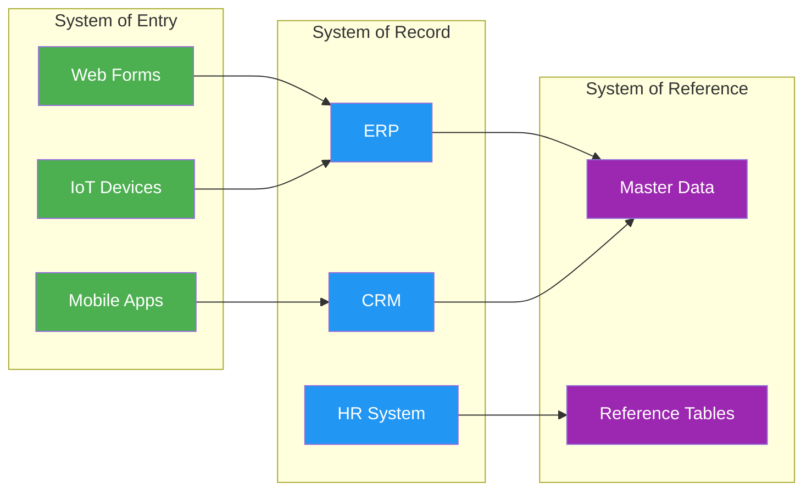
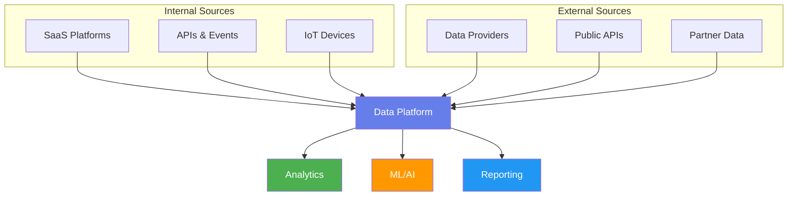
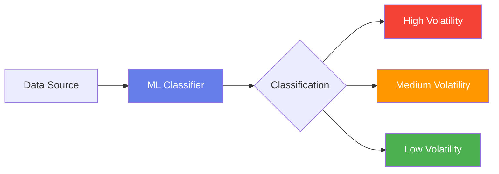
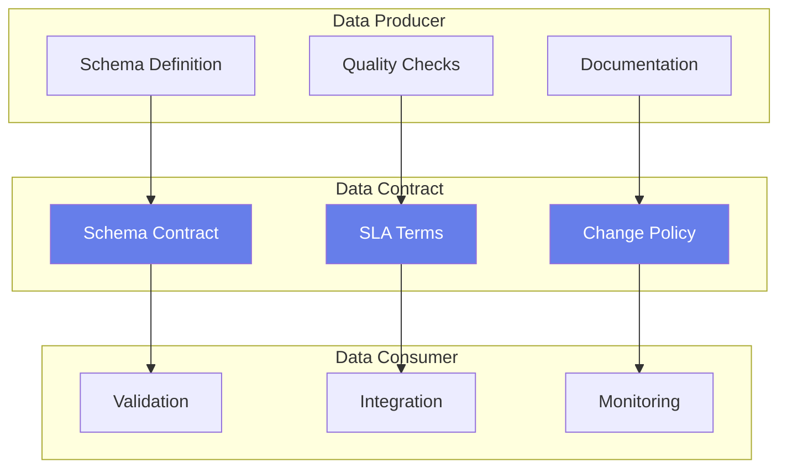
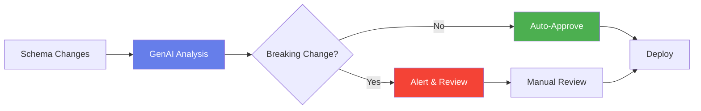

# Module 1: Foundations of Data & Modern Data Sources

## Module Intent

Establish a rigorous mental model of what data is, where it comes from, and why context matters before any tooling discussion begins.

---

## Unit 1.1: What Is Data (Really)?

### Core Concepts

- **Structured data**: Highly organized data that fits neatly into tables (e.g., relational databases)
- **Semi-structured data**: Data with some organizational properties but not rigid schema (e.g., JSON, XML)
- **Unstructured data**: Data without predefined format (e.g., text documents, images, videos)
- **Operational vs analytical data**: Transactional data for day-to-day operations vs aggregated data for insights
- **Metadata vs data**: Data about data (schema, lineage, quality metrics) vs the actual content

### AI / GenAI Sub-thread

!!! info "AI Integration"
    LLMs transform unstructured data (text, images, audio) into vector representations, enabling semantic search, similarity matching, and downstream analytics previously impossible with classical schemas.

---

## Unit 1.2: Systems of Entry, Record, and Reference

### Core Concepts

| System Type | Description | Example |
|-------------|-------------|---------|
| **System of Entry (SoE)** | Where data first enters the organization | Web forms, mobile apps, IoT sensors |
| **System of Record (SoR)** | Authoritative source of truth for specific data | ERP, CRM, HR systems |
| **System of Reference (SoRef)** | Provides context and lookup data | Master data repositories |

- **Trust boundaries**: Define where data ownership and responsibility change
- **Ownership**: Clear accountability for data quality and governance

### AI / GenAI Sub-thread

!!! info "AI Integration"
    AI models infer system roles by analyzing data freshness, mutation frequency, access patterns, and lineage graphs instead of relying solely on documentation.

---

## Unit 1.3: Modern Data Sources Landscape

### Core Concepts

The modern data landscape encompasses diverse sources:

- **SaaS platforms**: Salesforce, Workday, ServiceNow, etc.
- **APIs and event streams**: REST APIs, GraphQL, Kafka, Pub/Sub
- **IoT and machine-generated data**: Sensors, logs, telemetry
- **External data providers**: Market data, weather, demographics

### AI / GenAI Sub-thread

!!! info "AI Integration"
    ML models classify data sources by volatility, reliability, and business impact using historical ingestion and consumption signals.

---

## Unit 1.4: Data Contracts & Producer Responsibility

### Core Concepts

Data contracts establish formal agreements between data producers and consumers:

| Component | Description |
|-----------|-------------|
| **Schema contracts** | Define structure, types, and constraints |
| **Change management** | Processes for evolving schemas safely |
| **Data SLAs** | Service level agreements for quality, freshness, availability |

### AI / GenAI Sub-thread

!!! info "AI Integration"
    GenAI auto-generates data contracts and flags breaking changes by comparing evolving schemas against historical consumer expectations.

---

## Module Summary

This module established the foundational concepts for understanding data in modern organizations:

1. **Data Types**: Understanding structured, semi-structured, and unstructured data
2. **System Roles**: Distinguishing between Systems of Entry, Record, and Reference
3. **Data Sources**: Navigating the modern landscape of internal and external data sources
4. **Data Contracts**: Implementing formal agreements for data governance

!!! success "Key Takeaway"
    Before diving into tools and technologies, it's essential to build a strong mental model of what data is, where it originates, and how it flows through organizational systems.

---

**Next Module**: *Coming Soon* — Data Quality & Governance
