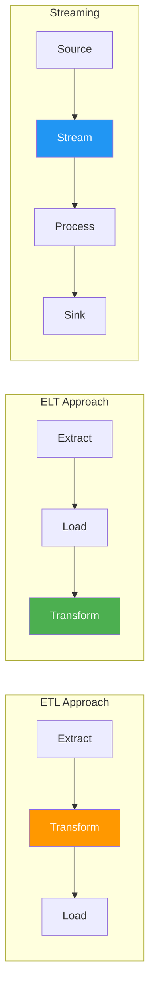
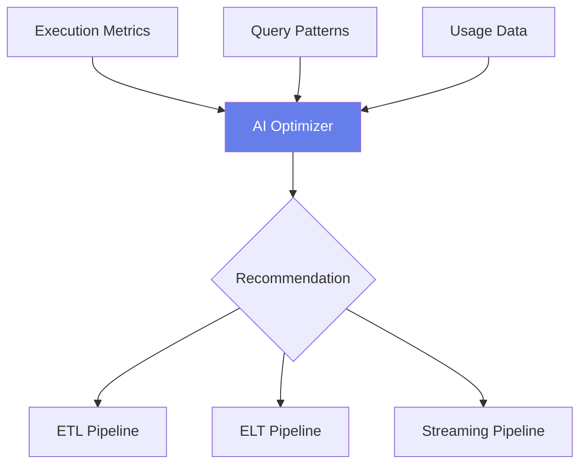
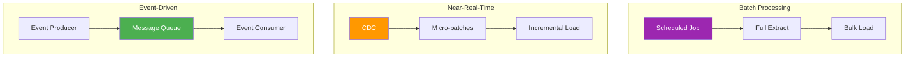
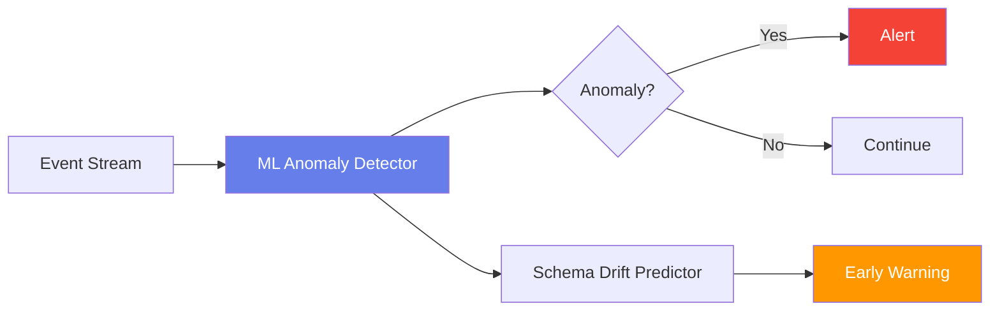
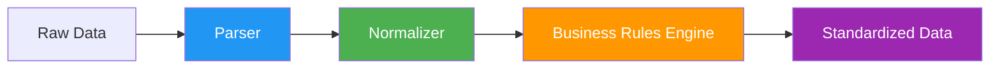
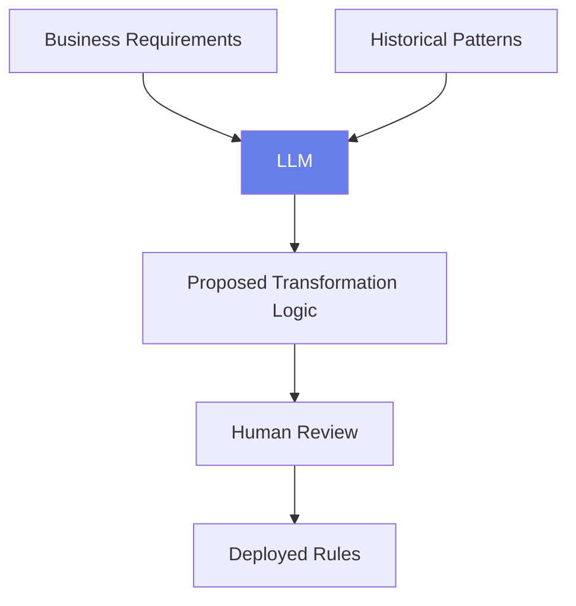
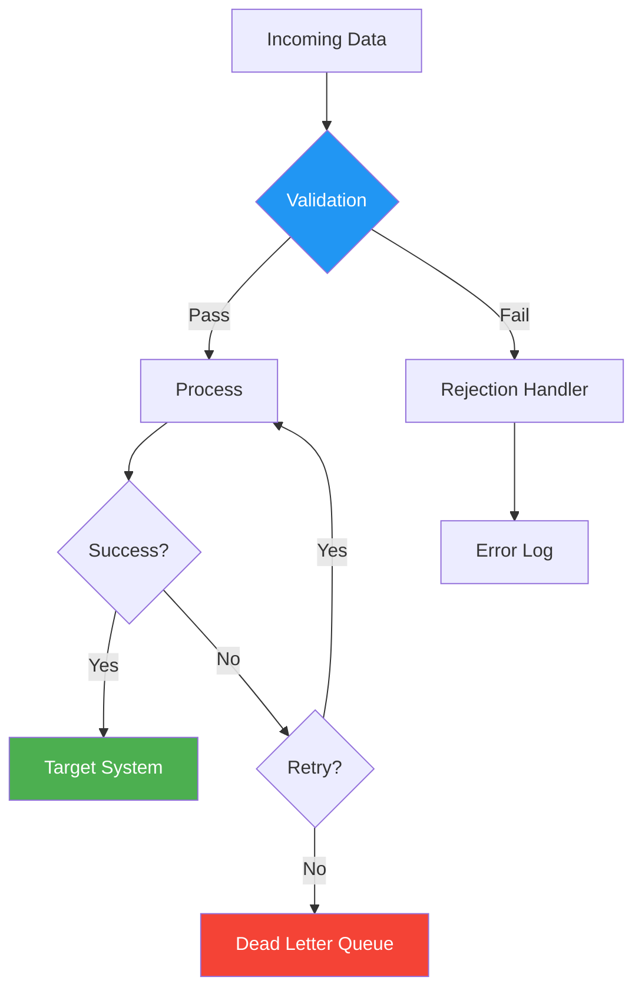
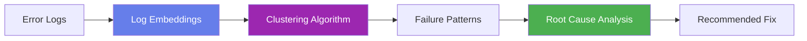

# Module 2: Data Integration & Movement Architectures

## Module Intent

Explain how data moves across systems and why architectural choices create long-term consequences.

---

## Unit 2.1: ETL vs ELT vs Streaming

### Core Concepts

Understanding the fundamental approaches to data movement:

| Approach | Description | Best For |
|----------|-------------|----------|
| **ETL** | Extract, Transform, Load - transformation before loading | Legacy systems, structured data |
| **ELT** | Extract, Load, Transform - transformation after loading | Cloud data warehouses, big data |
| **Streaming** | Continuous real-time data flow | Event-driven architectures |

- **Transformation placement**: Where and when data is transformed affects cost and flexibility
- **Cost and latency trade-offs**: Batch processing is cheaper but slower; streaming is faster but more expensive
- **Governance implications**: Different approaches require different governance strategies

### AI / GenAI Sub-thread

!!! info "AI Integration"
    AI systems learn optimal pipeline designs by observing execution cost, query behavior, and downstream usage patterns.

---

## Unit 2.2: Batch, Near-Real-Time, and Event-Driven Integration

### Core Concepts

Different integration patterns serve different business needs:

- **CDC (Change Data Capture)**: Captures and tracks data changes in source systems
- **Message queues**: Asynchronous communication between systems (Kafka, RabbitMQ)
- **Event schemas**: Structured definitions for event data formats

### AI / GenAI Sub-thread

!!! info "AI Integration"
    ML detects event anomalies and predicts schema drift in streaming systems before failures occur.

---

## Unit 2.3: Data Transformation & Standardization

### Core Concepts

Transforming raw data into usable formats:

- **Parsing**: Breaking down complex data structures into components
- **Normalization**: Standardizing data formats and values
- **Business rules**: Applying domain-specific logic to data

### AI / GenAI Sub-thread

!!! info "AI Integration"
    LLMs propose transformation logic directly from business language and historical correction patterns.

---

## Unit 2.4: Integration Error Handling & Observability

### Core Concepts

Managing failures in data pipelines:

| Component | Purpose |
|-----------|---------|
| **Rejections** | Records that fail validation rules |
| **Retries** | Automatic re-attempts for transient failures |
| **Dead-letter queues** | Storage for messages that cannot be processed |

### AI / GenAI Sub-thread

!!! info "AI Integration"
    AI-driven root cause analysis clusters failures using log embeddings instead of brittle keyword matching.

---

## Module Summary

This module covered the essential concepts of data integration and movement:

1. **Pipeline Architectures**: Understanding ETL, ELT, and streaming approaches
2. **Integration Patterns**: Batch, near-real-time, and event-driven strategies
3. **Transformation**: Parsing, normalization, and business rules
4. **Error Handling**: Building resilient pipelines with proper observability

!!! success "Key Takeaway"
    Architectural choices in data integration have long-term consequences. Understanding the trade-offs between different approaches is essential for building scalable, maintainable data systems.

---

**Next Module**: [Module 3 - Data Quality Engineering](module3.md)
