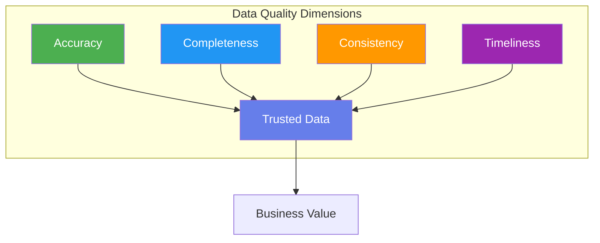
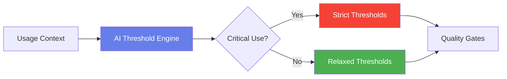
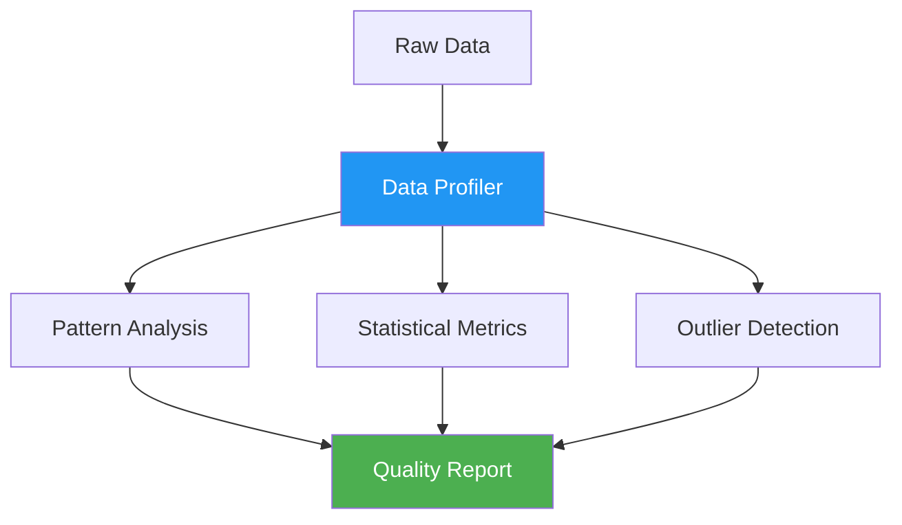
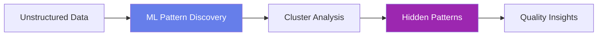
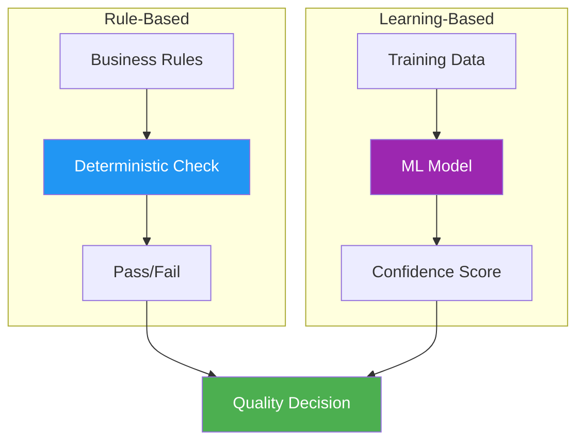
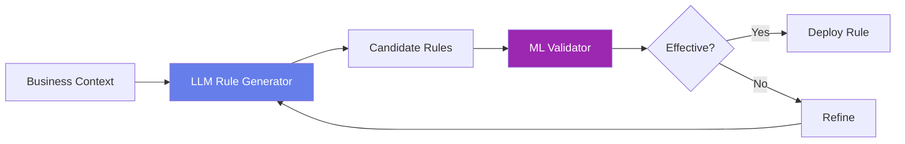
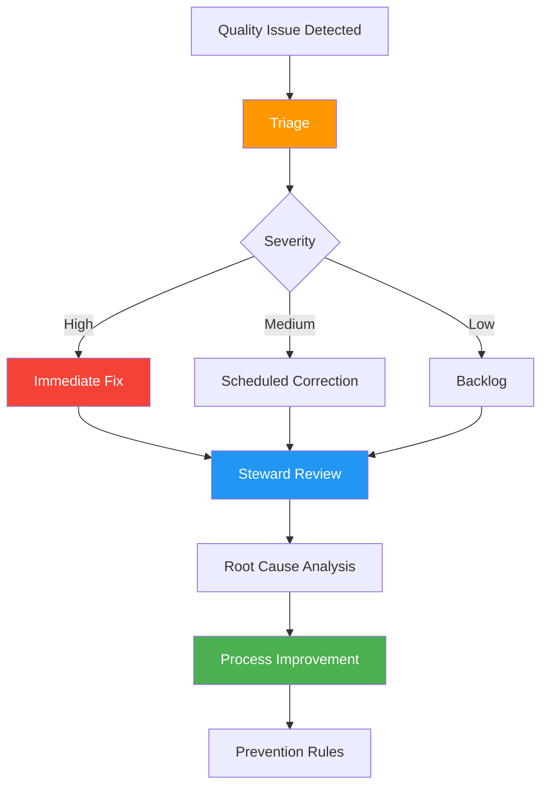
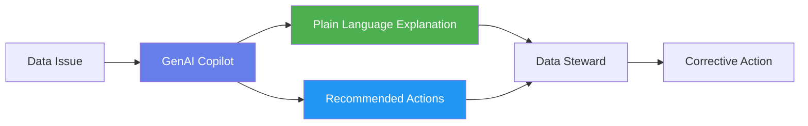

# Module 3: Data Quality Engineering

## Module Intent

Move beyond checkbox data quality into adaptive, context-aware quality systems.

---

## Unit 3.1: Dimensions of Data Quality

### Core Concepts

The fundamental dimensions that define data quality:

| Dimension | Description | Example |
|-----------|-------------|---------|
| **Accuracy** | Data correctly represents real-world values | Customer address matches actual location |
| **Completeness** | All required data is present | No missing mandatory fields |
| **Consistency** | Data is uniform across systems | Same customer ID format everywhere |
| **Timeliness** | Data is available when needed | Real-time inventory updates |

### AI / GenAI Sub-thread

!!! info "AI Integration"
    AI dynamically adjusts quality thresholds based on how and where data is consumed.

---

## Unit 3.2: Profiling & Quality Assessment

### Core Concepts

Techniques for understanding and measuring data quality:

- **Pattern discovery**: Identifying data formats and structures
- **Outlier detection**: Finding anomalous values
- **Statistical profiling**: Computing distributions and metrics

### AI / GenAI Sub-thread

!!! info "AI Integration"
    Unsupervised ML identifies hidden patterns in semi-structured and textual data fields.

---

## Unit 3.3: Rule-Based vs Learning-Based Controls

### Core Concepts

Two approaches to data quality control:

| Approach | Characteristics | Use Case |
|----------|-----------------|----------|
| **Deterministic rules** | Explicit, predictable, auditable | Regulatory compliance |
| **Probabilistic scoring** | Flexible, adaptive, confidence-based | Complex pattern matching |

### AI / GenAI Sub-thread

!!! info "AI Integration"
    LLMs suggest candidate rules while ML models validate effectiveness against historical outcomes.

---

## Unit 3.4: Remediation & Stewardship

### Core Concepts

Processes for fixing and maintaining data quality:

- **Correction workflows**: Systematic processes for fixing data issues
- **Feedback loops**: Continuous improvement through monitoring and learning

### AI / GenAI Sub-thread

!!! info "AI Integration"
    GenAI copilots explain issues to data stewards and recommend corrective actions in plain language.

---

## Module Summary

This module covered advanced data quality engineering:

1. **Quality Dimensions**: Accuracy, completeness, consistency, and timeliness
2. **Assessment Techniques**: Profiling, pattern discovery, and outlier detection
3. **Control Approaches**: Rule-based and learning-based quality controls
4. **Remediation**: Correction workflows and continuous improvement

!!! success "Key Takeaway"
    Modern data quality goes beyond simple validation rules. Context-aware, adaptive quality systems that combine deterministic rules with machine learning provide the most robust approach to maintaining data trust.

---

**Next Module**: [Module 4 - Master Data Management](module4.md)
