# Module 4: Master Data Management (MDM)

## Module Intent

Establish enterprise-grade identity, consistency, and trust across core business entities.

---

## Unit 4.1: MDM Concepts & Styles

### Core Concepts

Different approaches to implementing Master Data Management:

| Style | Description | Data Location |
|-------|-------------|---------------|
| **Registry** | Pointers to source systems, no data copy | Distributed |
| **Consolidation** | Read-only master copy for analytics | Centralized copy |
| **Coexistence** | Bi-directional sync with sources | Hybrid |
| **Centralized** | Single authoritative source | Central hub |

### AI / GenAI Sub-thread

!!! info "AI Integration"
    AI evaluates domain readiness and recommends MDM styles based on organizational maturity signals.

---

## Unit 4.2: Identity Resolution & Matching

### Core Concepts

Techniques for identifying and linking related records:

- **Deterministic matching**: Exact matches on key fields
- **Probabilistic matching**: Fuzzy matching with confidence scores
- **Survivorship**: Rules for selecting the best value from multiple sources

### AI / GenAI Sub-thread

!!! info "AI Integration"
    ML-based entity resolution leverages embeddings, phonetics, and contextual similarity.

---

## Unit 4.3: Golden Records & XREF

### Core Concepts

Creating and maintaining the single version of truth:

| Concept | Description |
|---------|-------------|
| **Survivorship rules** | Logic for selecting best values |
| **Lineage** | Tracking data origin and transformations |
| **Traceability** | Ability to trace back to source records |

```mermaid
flowchart TB
    subgraph Sources["Source Records"]
        A1[CRM Record]
        A2[ERP Record]
        A3[Web Record]
    end
    
    A1 --> B[Survivorship Engine]
    A2 --> B
    A3 --> B
    B --> C[Golden Record]
    
    subgraph XREF["Cross-Reference Table"]
        D1[Source ID → Golden ID]
        D2[Lineage Metadata]
    end
    
    C --> XREF
    
    style B fill:#FF9800,color:#fff
    style C fill:#4CAF50,color:#fff
```

### AI / GenAI Sub-thread

!!! info "AI Integration"
    LLMs generate human-readable explanations for why a golden value was selected.

---

## Unit 4.4: Hierarchies & Relationships

### Core Concepts

Managing complex entity relationships:

- **Parent-child**: Organizational structures, product categories
- **Network relationships**: Many-to-many connections
- **Temporal links**: Time-based relationship validity

### AI / GenAI Sub-thread

!!! info "AI Integration"
    Graph ML detects hierarchy anomalies and infers missing relationships.

---

## Module Summary

This module covered Master Data Management fundamentals:

1. **MDM Styles**: Registry, consolidation, coexistence, and centralized approaches
2. **Identity Resolution**: Deterministic and probabilistic matching techniques
3. **Golden Records**: Creating and maintaining the single source of truth
4. **Relationships**: Managing hierarchies and complex entity networks

!!! success "Key Takeaway"
    MDM provides the foundation for accurate and trustworthy reporting across the enterprise. The choice of MDM style should align with organizational maturity and business requirements.

---

**Next Module**: [Module 5 - Data Governance & Trust Frameworks](module5.md)
