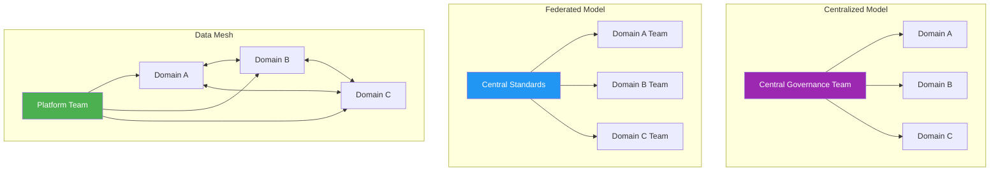
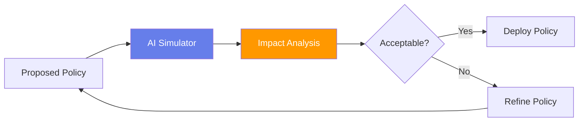
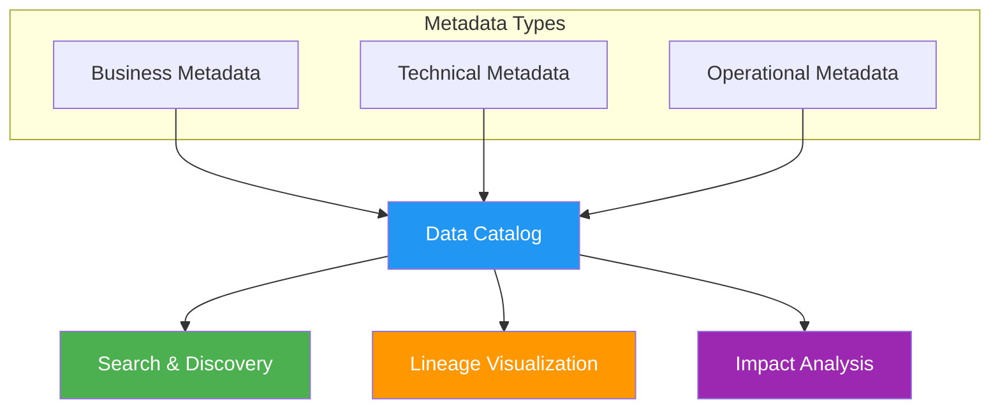
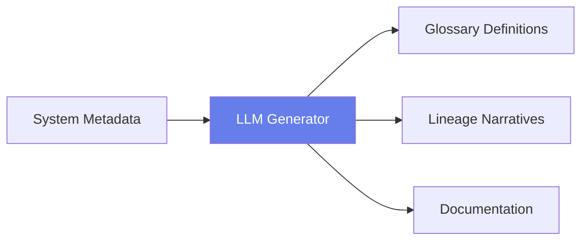
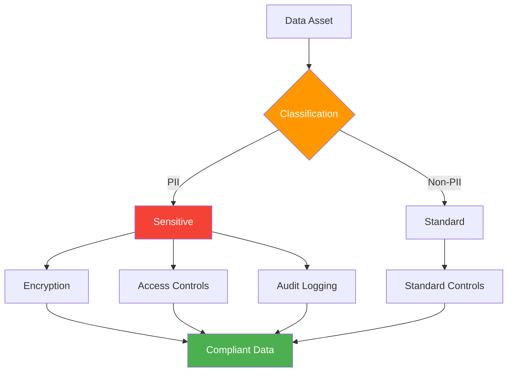
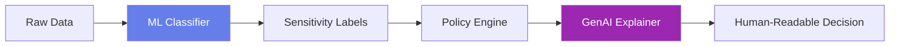
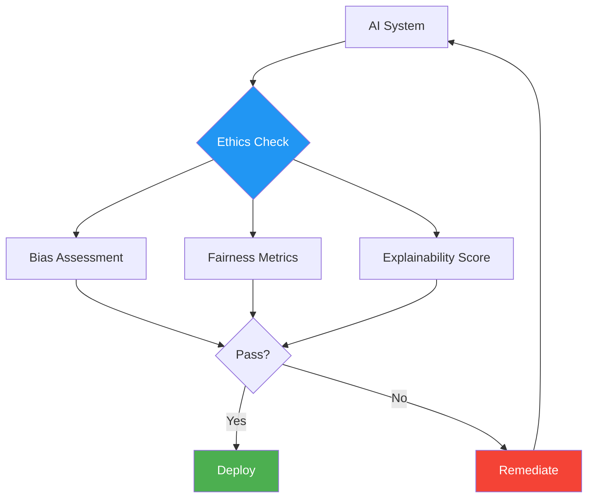
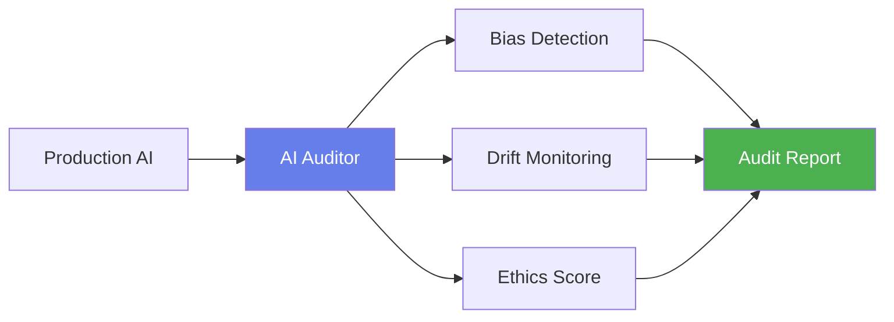

# Module 5: Data Governance & Trust Frameworks

## Module Intent

Transform governance from bureaucracy into executable infrastructure.

---

## Unit 5.1: Governance Operating Models

### Core Concepts

Different approaches to organizing data governance:

| Model | Description | Best For |
|-------|-------------|----------|
| **Centralized** | Single governance team controls all decisions | Highly regulated industries |
| **Federated** | Domain teams govern their own data with central standards | Large enterprises |
| **Data Mesh** | Domain ownership with self-serve infrastructure | Distributed organizations |

### AI / GenAI Sub-thread

!!! info "AI Integration"
    AI simulates policy impact across domains before enforcement.

---

## Unit 5.2: Metadata, Lineage & Catalogs

### Core Concepts

Building blocks of data understanding:

- **Business metadata**: Definitions, ownership, business context
- **Technical metadata**: Schema, formats, storage details
- **End-to-end lineage**: Complete data journey from source to consumption

### AI / GenAI Sub-thread

!!! info "AI Integration"
    LLMs auto-generate glossary definitions and lineage narratives from system metadata.

---

## Unit 5.3: Privacy, Security & Compliance

### Core Concepts

Protecting data and meeting regulatory requirements:

| Area | Focus | Examples |
|------|-------|----------|
| **PII Detection** | Identifying sensitive data | Names, SSN, emails |
| **Access Control** | Managing who can see what | RBAC, ABAC |
| **Compliance** | Meeting regulatory requirements | GDPR, CCPA, HIPAA |

### AI / GenAI Sub-thread

!!! info "AI Integration"
    ML identifies sensitive data while GenAI explains policy decisions to humans.

---

## Unit 5.4: Data Ethics & Responsible AI

### Core Concepts

Ensuring ethical use of data and AI:

- **Bias**: Systematic errors that create unfair outcomes
- **Fairness**: Equal treatment across protected groups
- **Explainability**: Ability to understand and explain decisions

### AI / GenAI Sub-thread

!!! info "AI Integration"
    AI systems audit other AI systems for bias and ethical drift.

---

## Module Summary

This module covered data governance and trust frameworks:

1. **Operating Models**: Centralized, federated, and data mesh approaches
2. **Metadata Management**: Catalogs, lineage, and discovery
3. **Privacy & Security**: PII protection and compliance
4. **Ethics**: Bias, fairness, and responsible AI

!!! success "Key Takeaway"
    Effective governance is not about creating bureaucracy—it's about building executable infrastructure that enables trust while maintaining agility. Modern governance combines policy with automation.

---

**Next Module**: [Module 6 - Data Publication & Consumption](module6.md)
