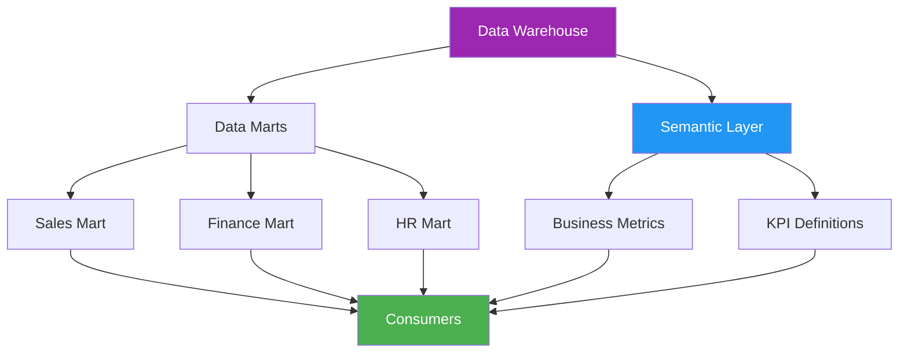
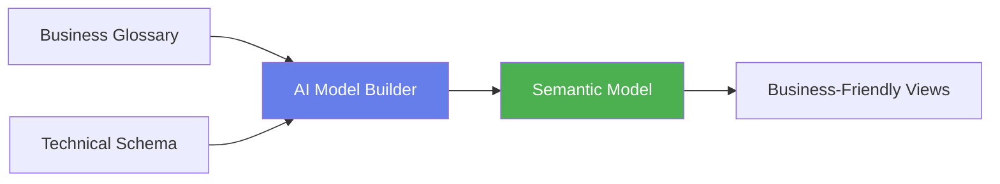
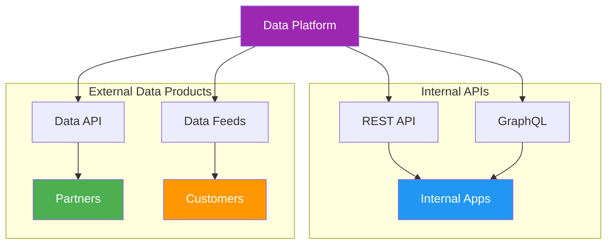
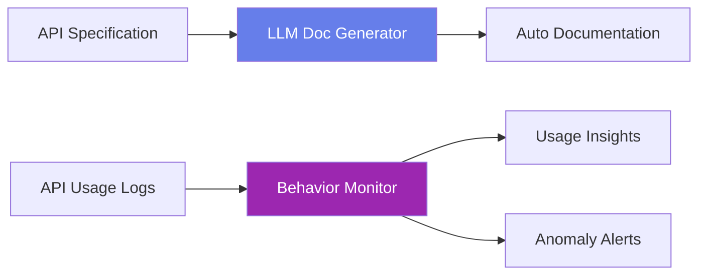
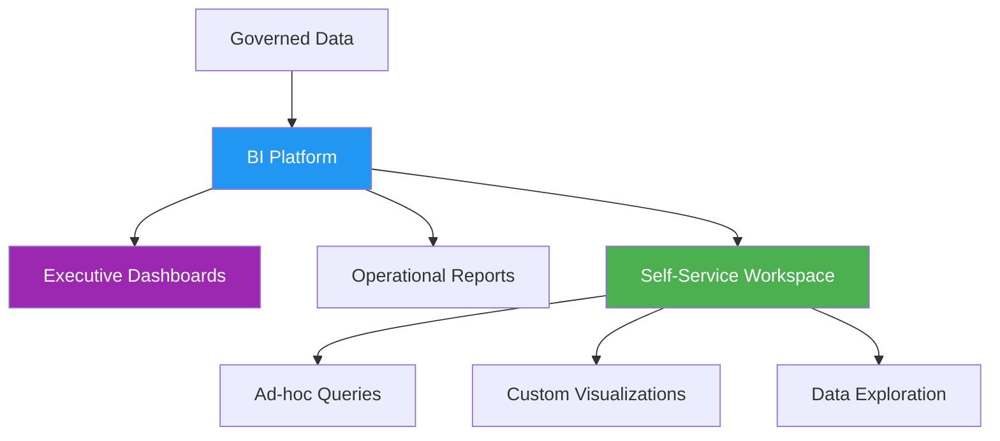
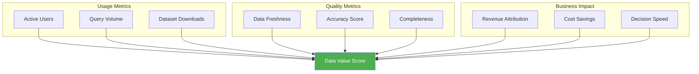
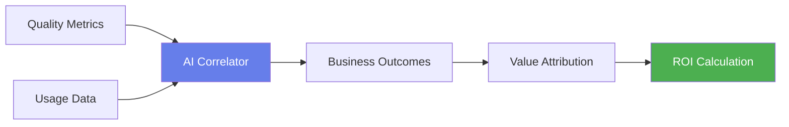

# Module 6: Data Publication & Consumption

## Module Intent

Ensure data is consumable, trusted, and valuable.

---

## Unit 6.1: Analytical Data Products

### Core Concepts

Packaging data for consumption:

| Product Type | Description | Consumers |
|--------------|-------------|-----------|
| **Data marts** | Subject-specific data subsets | Business analysts |
| **Semantic layers** | Business-friendly data abstractions | Self-service users |
| **KPIs** | Key performance indicators | Executives |

### AI / GenAI Sub-thread

!!! info "AI Integration"
    AI auto-builds semantic models aligned with business terminology.

---

## Unit 6.2: APIs & Data Sharing

### Core Concepts

Programmatic access to data:

- **Internal APIs**: Data access for internal applications
- **External data products**: Monetizable data offerings

### AI / GenAI Sub-thread

!!! info "AI Integration"
    LLMs generate API documentation and monitor consumer behavior.

---

## Unit 6.3: BI & Self-Service Analytics

### Core Concepts

Empowering users to explore data:

- **Dashboards**: Pre-built visualizations for monitoring
- **Exploratory analysis**: Ad-hoc data investigation tools

### AI / GenAI Sub-thread

!!! info "AI Integration"
    Natural language querying allows users to ask questions directly against governed datasets.

---

## Unit 6.4: Measuring Data Value

### Core Concepts

Quantifying the business impact of data:

| Metric | Description |
|--------|-------------|
| **Adoption metrics** | How widely data is used |
| **ROI** | Return on data investments |

### AI / GenAI Sub-thread

!!! info "AI Integration"
    AI correlates data quality and usage with business outcomes.

---

## Module Summary

This module covered data publication and consumption:

1. **Data Products**: Building marts, semantic layers, and KPIs
2. **APIs**: Internal and external data sharing mechanisms
3. **Self-Service**: BI platforms and exploratory analytics
4. **Value Measurement**: Quantifying data's business impact

!!! success "Key Takeaway"
    Data only creates value when it's consumed. Building accessible, trusted data products and measuring their impact is essential for demonstrating and maximizing the return on data investments.

---

**Next Module**: [Module 7 - The AI-Native Data Management Future](module7.md)
