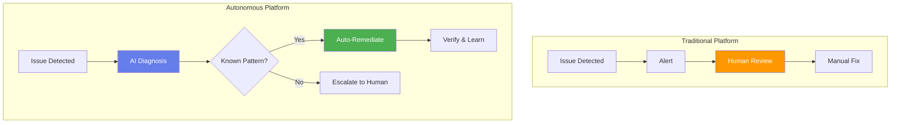
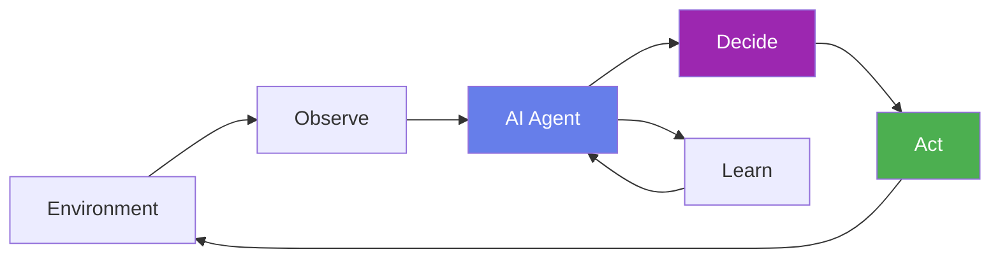
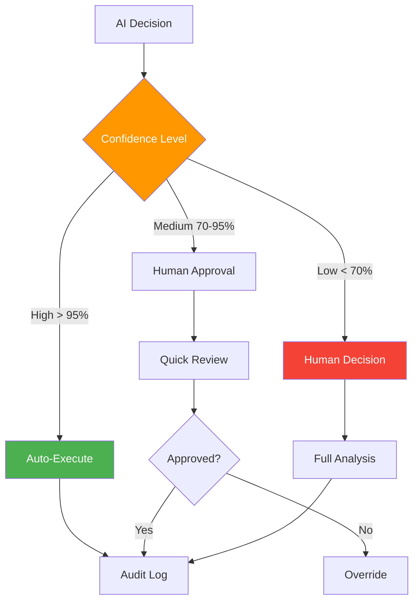
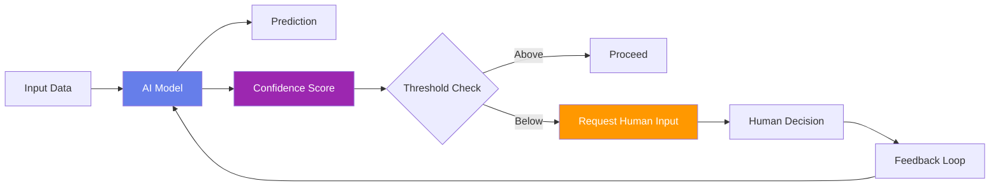
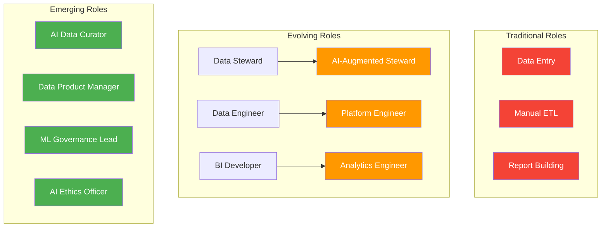
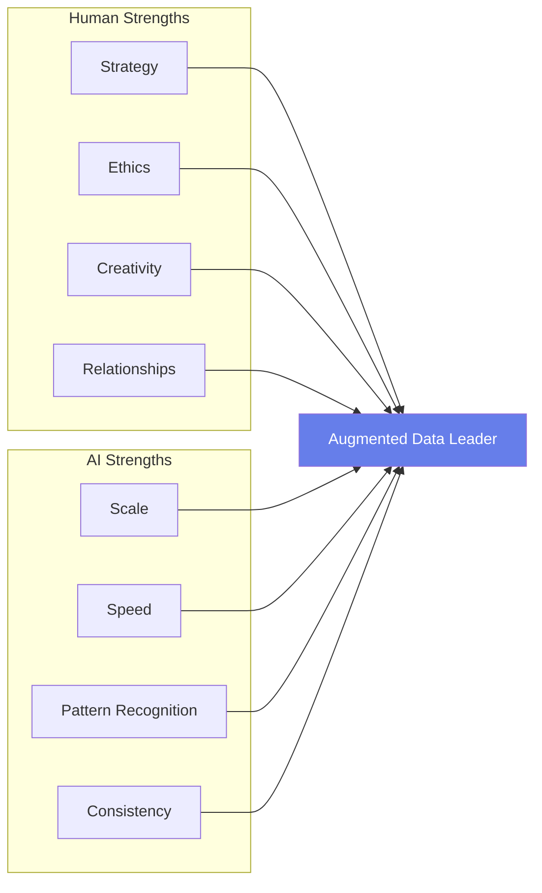
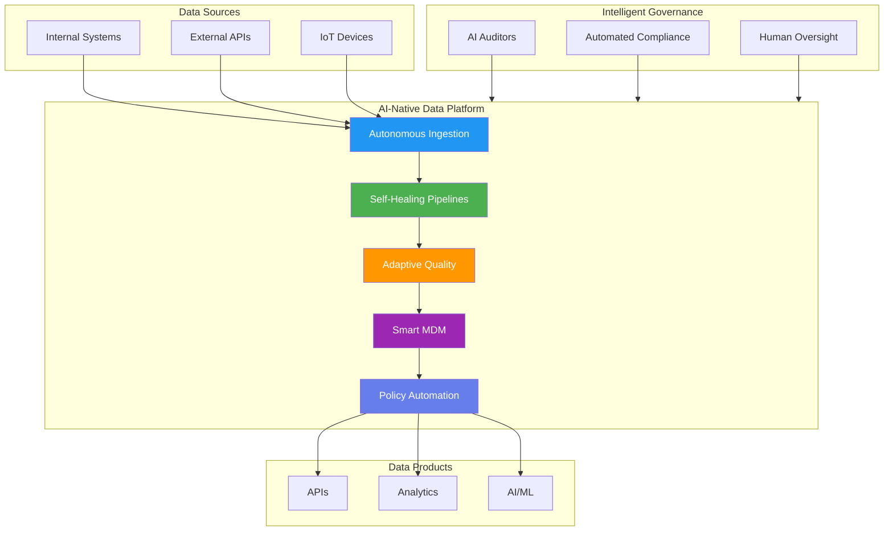

# Module 7: The AI-Native Data Management Future

## Module Intent

Prepare students for autonomous, agent-driven data ecosystems.

---

## Unit 7.1: Autonomous Data Platforms

### Core Concepts

The evolution toward self-managing data systems:

- **Self-healing pipelines**: Automatic detection and recovery from failures
- **Policy-driven automation**: Rules that execute without human intervention

### AI / GenAI Sub-thread

!!! info "AI Integration"
    Agent-based systems observe, decide, and act without human initiation.

---

## Unit 7.2: Human-in-the-Loop Design

### Core Concepts

Balancing automation with human oversight:

| Concept | Description |
|---------|-------------|
| **Trust thresholds** | Confidence levels that trigger human review |
| **Escalation paths** | Clear routes for AI to request human input |

### AI / GenAI Sub-thread

!!! info "AI Integration"
    AI systems calculate confidence and request human input only when needed.

---

## Unit 7.3: Career Evolution in the AI Era

### Core Concepts

How data management roles are transforming:

- **Emerging roles**: AI Data Curator, Data Product Manager, ML Governance Lead
- **Skill shifts**: From manual tasks to AI orchestration and oversight

### AI / GenAI Sub-thread

!!! info "AI Integration"
    AI augments—not replaces—human judgment in data leadership roles.

---

## The Future Data Ecosystem

A vision of how all the pieces come together:

---

## Module Summary

This module explored the future of data management:

1. **Autonomous Platforms**: Self-healing, policy-driven data systems
2. **Human-in-the-Loop**: Balancing AI automation with human oversight
3. **Career Evolution**: New roles and skills for the AI era

!!! success "Key Takeaway"
    The future of data management is not about replacing humans with AI—it's about creating intelligent systems that amplify human capabilities. Success requires embracing new skills while maintaining focus on ethics, strategy, and business value.

---

## Course Completion

Congratulations on completing the **Data Management Training Portal** curriculum! You now have a comprehensive understanding of:

- Data foundations and modern data sources
- Integration and movement architectures
- Data quality engineering
- Master data management
- Governance and trust frameworks
- Data publication and consumption
- The AI-native future of data management

!!! quote "Final Thought"
    "Data is the new oil, but like oil, it must be refined to be valuable. The data professionals of tomorrow will be those who can orchestrate AI-powered systems while maintaining the human judgment that ensures data serves people, not the other way around."
