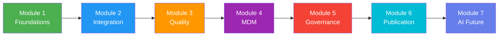

# Data Management Training Portal

    <em>Created by <strong>Raja Shahnawaz Soni</strong></em>

Welcome to the **Data Management Training Portal** — a comprehensive resource designed to equip you with the foundational knowledge and practical skills needed to excel in modern data management.

---

## About This Course

This training program provides a rigorous, structured approach to understanding data management concepts, from fundamental principles to advanced AI-driven methodologies. Each module is carefully crafted to build upon previous knowledge, ensuring a solid foundation for your data management journey.

!!! info "Course Author"
    This curriculum has been designed and developed by **Raja Shahnawaz Soni**, a dedicated data management professional committed to excellence, ethical AI practices, and continuous learning. [Learn more about the author →](about.md)

---

## What You Will Learn

### Data Fundamentals
Understand the core concepts of structured, semi-structured, and unstructured data, along with the distinction between operational and analytical data.

### Systems Architecture
Master the concepts of Systems of Entry, Record, and Reference, and understand trust boundaries and data ownership.

### Modern Data Sources
Explore the landscape of modern data sources including SaaS platforms, APIs, IoT, and external data providers.

### Data Contracts
Learn about schema contracts, change management, and data SLAs for robust data governance.

---

## Course Structure

| Module | Topic | Focus Area |
|--------|-------|------------|
| **Module 1** | [Foundations of Data & Modern Data Sources](course/module1.md) | Core concepts, system roles, data landscape |
| **Module 2** | [Data Integration & Movement Architectures](course/module2.md) | ETL/ELT, streaming, transformation |
| **Module 3** | [Data Quality Engineering](course/module3.md) | Quality dimensions, profiling, remediation |
| **Module 4** | [Master Data Management](course/module4.md) | MDM styles, identity resolution, golden records |
| **Module 5** | [Data Governance & Trust Frameworks](course/module5.md) | Governance models, metadata, compliance |
| **Module 6** | [Data Publication & Consumption](course/module6.md) | Data products, APIs, BI, value measurement |
| **Module 7** | [The AI-Native Data Management Future](course/module7.md) | Autonomous platforms, human-in-the-loop, careers |

---

## Getting Started

Navigate to the **Course** section in the sidebar to begin your learning journey. We recommend starting with **Module 1: Foundations of Data & Modern Data Sources** to establish a strong conceptual foundation.

!!! tip "Pro Tip"
    Use the search bar at the top to quickly find specific topics, and toggle between light and dark modes using the icon in the header for comfortable reading.

---

## AI & GenAI Integration

Throughout this course, you'll find dedicated **AI/GenAI Sub-threads** that explore how artificial intelligence and generative AI are transforming traditional data management practices. These sections provide cutting-edge insights into:

- Vector representations and semantic search
- Automated system role inference
- ML-based data source classification
- AI-generated data contracts
- Autonomous data platforms
- Human-in-the-loop design patterns

---

## Complete Learning Path

---

## Connect with the Author

Have questions, feedback, or interested in collaboration? Connect with **Raja Shahnawaz Soni**:

| Platform | Link |
|----------|------|
| **LinkedIn** | [linkedin.com/in/raja-shahnawaz](https://www.linkedin.com/in/raja-shahnawaz/) |
| **GitHub** | [github.com/rajasoni](https://github.com/rajasoni) |
| **Twitter** | [twitter.com/rajasoni](https://twitter.com/rajasoni) |
| **Email** | [raja.cloudmdm@gmail.com](mailto:raja.cloudmdm@gmail.com) |

---

**Ready to begin?** Navigate to [Module 1: Foundations of Data](course/module1.md) to start your learning journey.

---

    <h3 style="margin: 0; color: white;">Data Management Training Portal</h3>
    
Created with ❤️ by <strong>Raja Shahnawaz Soni</strong>

    
Empowering the next generation of data professionals

    
📧 <a href="mailto:raja.cloudmdm@gmail.com" style="color: white;">raja.cloudmdm@gmail.com</a>

---

**Copyright © 2024-2026 Raja Shahnawaz Soni. All Rights Reserved. | Contact: [raja.cloudmdm@gmail.com](mailto:raja.cloudmdm@gmail.com)**
